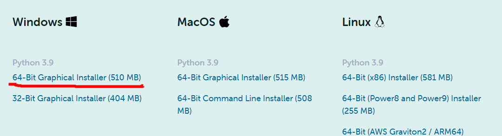
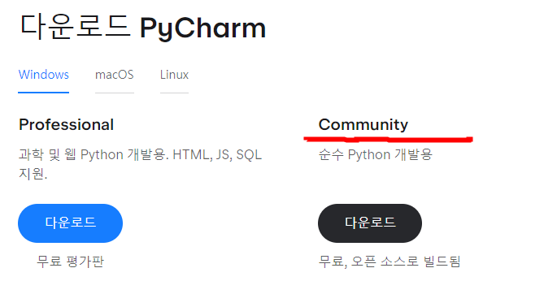
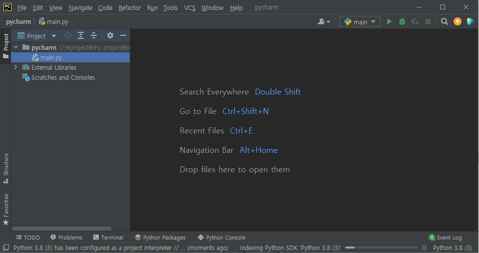
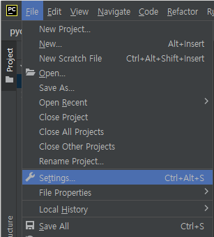
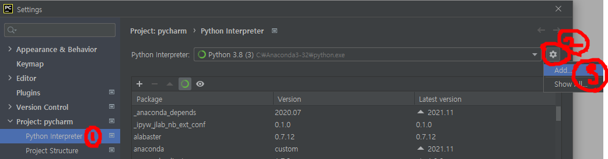
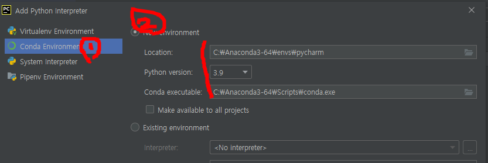
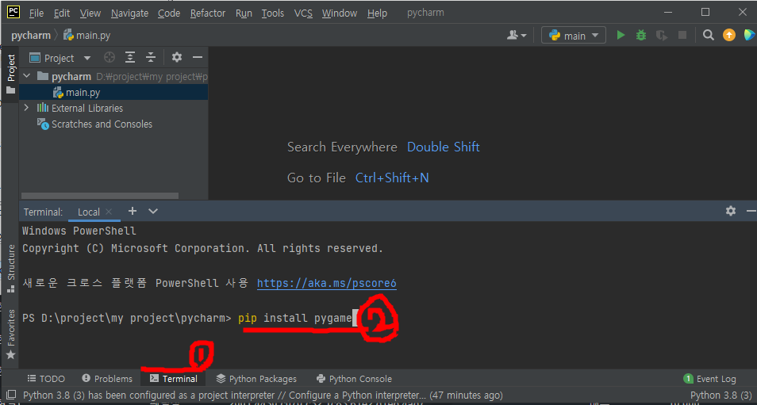

# 프로그램설치 및 환경구성


## 아나콘다 세팅
[다운로드](https://www.anaconda.com/products/individual) <br>
위의 사이트에서 하단으로 스크롤 하면 링크가 나온다. <br>
본인의 시스템에 맞는 프로그램을 다운로드한다.


## 파이썬 세팅
[다운로드](https://www.python.org/downloads/)
아나콘다만 설치해도..

## PyCharm(IDE) 설치
[다운로드](https://www.jetbrains.com/ko-kr/pycharm/download/)

Community는 무료이며 이것을 이용해도 개발에는 부족함이 없다.



### 화면구성
- 기본화면 구성


### 환결설정
- File > Settings....



- Project > Python Interpreter : 세팅아이콘 > Add



- Conda Environment > New Environment


세팅완료!!

### 패키지 설치

- PyCharm 하단의 "Terminal" 클릭
- Command Line에 pip install [패키기명]




### 패키지 설치 > pygame
- 아래처럼 입력하면 pygame 패키지가 설치됩니다.
```
pip install pygame
```