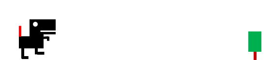

# 구글공룡게임
참조 : https://github.com/BlockDMask/Python_dinosaur_game

## 기본문법
구글공룡게임에서는 python의 간단한 구조를 엿볼수 있습니다.

### 함수설정
함수란무엇인가?
> 반복적으로 사용되는 부분을 재사용하기 위해 미리 정의해 두는 것

파이썬의 함수 구조
```
def 함수명(매개변수):
    <수행할 문장1>
    ...
```
게임에서는 아래와 같은 함수를 볼수 있다.
```
def main():  # 함수정의 부분
    pass
```

__name__ 이 __main__ 일경우 위에서 정의된 함수 main()을 실행합니다. 
```
if __name__ == '__main__': 
    main()
```

[문법] while
```
while <조건문>:  # 조건이 참(True)이면 실행
    <수행할 문장1>
    ...
```

[문법] if
```
if <조건문>:  # 조건이 참(True)이면 실행
    <수행할 문장1>
    ...
```

[문법] if-else
```
if <조건문>:  # 조건이 참(True)이면 실행
    <수행할 문장1>
    ...
else:
    <수행할 문장2>
    ...
```

[문법] if-elif-else
```
if <조건문>:  # 조건이 참(True)이면 실행
    <수행할 문장1>
    ...
elif <조건문>:  # 조건이 참(True)이면 실행
    <수행할 문장2>
    ...
else:
    <수행할 문장3>
    ...
```


본격적으로 소스분석을 해 보겠습니다.
먼저 전체 소스는 아래와 같습니다.
### Full Source
```
import pygame
import sys

pygame.init()
pygame.display.set_caption('Jumping dino')
MAX_WIDTH = 800
MAX_HEIGHT = 400

def main():
    # set screen, fps
    screen = pygame.display.set_mode((MAX_WIDTH, MAX_HEIGHT))
    fps = pygame.time.Clock()

    # dino
    imgDino1 = pygame.image.load('assets/images/dino1.png')
    imgDino2 = pygame.image.load('assets/images/dino2.png')
    dino_height = imgDino1.get_size()[1]
    dino_bottom = MAX_HEIGHT - dino_height
    dino_x = 50
    dino_y = dino_bottom
    jump_top = 200
    leg_swap = True
    is_bottom = True
    is_go_up = False

    # tree
    imgTree = pygame.image.load('assets/images/tree.png')
    tree_height = imgTree.get_size()[1]
    tree_x = MAX_WIDTH
    tree_y = MAX_HEIGHT - tree_height

    while True:
        screen.fill((255, 255, 255))

        # event check
        for event in pygame.event.get():
            if event.type == pygame.QUIT:
                pygame.quit()
                sys.exit()
            elif event.type == pygame.KEYDOWN:
                if is_bottom:
                    is_go_up = True
                    is_bottom = False

        # dino move
        if is_go_up:
            dino_y -= 10.0
        elif not is_go_up and not is_bottom:
            dino_y += 10.0

        # dino top and bottom check
        if is_go_up and dino_y <= jump_top:
            is_go_up = False

        if not is_bottom and dino_y >= dino_bottom:
            is_bottom = True
            dino_y = dino_bottom

        # tree move
        tree_x -= 12.0
        if tree_x <= 0:
            tree_x = MAX_WIDTH

        # draw tree
        screen.blit(imgTree, (tree_x, tree_y))

        # draw dino
        if leg_swap:
            screen.blit(imgDino1, (dino_x, dino_y))
            leg_swap = False
        else:
            screen.blit(imgDino2, (dino_x, dino_y))
            leg_swap = True

        # update
        pygame.display.update()
        fps.tick(30)  # 초당 30번 실행


if __name__ == '__main__':
    main()

```
### 기본 구성
```
import pygame
import sys

pygame.init()
pygame.display.set_caption('Jumping Dino')
screen_width = 800
screen_height = 400

# color
WHITE = (255, 255, 255)

def main():
    screen = pygame.display.set_mode((screen_width, screen_height))
    fps = pygame.time.Clock()

    while True:
        # event check
        for event in pygame.event.get():
            if event.type == pygame.QUIT:
                pygame.quit()
                sys.exit()

        screen.fill(WHITE)
        # update
        pygame.display.update()
        fps.tick(30)  # 초당 30번 실행

if __name__ == '__main__':
    main()
```
### 나무이미지를 로딩하고 좌측으로 움직이는 화면
```
def main():
    ..............
    # tree
    tree = pygame.image.load('assets/images/tree.png')
    tree_height = tree.get_size()[1]  # (width, height)
    tree_x = screen_width  # x 는 화면에 끝에 둔다
    tree_y = screen_height - tree_height  # y 는 화면의 높이에서 tree의 높이를 뺀 위치에 둔다.
    
     while True:
        ..............
        # tree move
        tree_x -= 12.0
        if tree_x <= 0:  # 만약 나무가 화면의 좌측끝(맨앞) 으로 오면 다시 화면의 뒤로 이동시킨다.
            tree_x = screen_width

        # draw tree
        screen.blit(tree, (tree_x, tree_y))
        ..............
```

### 공룡이미지를 로딩하고 뛰어가는 움직이는 효과
두개의 공룡 이미지를 번갈아 디스플레이 함으로서 공룡이 움직이는 듯한 효과를 준다.
```
def main():
    ..............
    # dinosour image
    dinosour1 = pygame.image.load('assets/images/dino1.png')
    dinosour2 = pygame.image.load('assets/images/dino2.png')
    dino_height = dinosour1.get_size()[1]
    dino_bottom = screen_height - dino_height
    dino_x = 50
    dino_y = dino_bottom
    leg_swap = True
    ..............
    while True:
    ..............
        # draw dino : 번갈아 공룡이미지를 표현
        if leg_swap:
            screen.blit(dinosour1, (dino_x, dino_y))
            leg_swap = False
        else:
            screen.blit(dinosour2, (dino_x, dino_y))
            leg_swap = True
    ..............
```

### 공룡 점프하기
아무키나 누르면 공룡이 점프하는 기능을 구현한다.
```
def main():
    ..............
    jump_top = 200  # 점프를 하면 200까지 올린다.
    is_bottom = True  # 점프중인지 아닌지 확인
    is_go_up = False  # 올라가는 중인지 내려오는 중인지 확인
    ..............
     while True:
        for event in pygame.event.get():
     ..............
            elif event.type == pygame.KEYDOWN:
                if is_bottom:  # 키보드를 누를때 현재 공룔이 바닥에 있으면
                    is_go_up = True
                    is_bottom = False
                    
                # dino jumping
        if is_go_up:  # 위로 올라가는 중이면
            dino_y -= 10.0
        elif not is_go_up and not is_bottom:  # 내려오지만 아직 바닥이 아닌 경우는
            dino_y += 10.0

        # dino top and bottom check
        if is_go_up and dino_y <= jump_top:  # 올라가는 중이고 점핑 한계에 도달하면
            is_go_up = False
            
        if not is_bottom and dino_y >= dino_bottom:  # 바닥보다 아래면
            is_bottom = True
            dino_y = dino_bottom
```
멋지게 달리고 나무를 뛰어넘는 무서운 공룡이 탄생했습니다.
부딛히거나 점수를 올리는 게임은 다른 게임 예제를 통해 말씀드리겠습니다.  